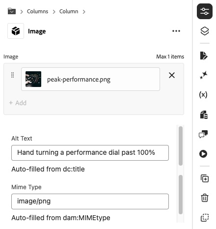
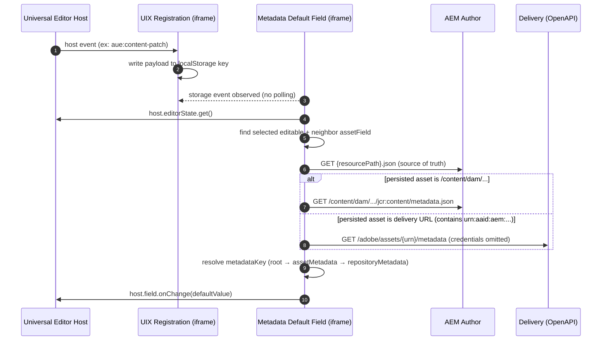

# Metadata Default Field (Universal Editor UI Extension)

## Purpose

**Metadata Default Field** is a Universal Editor **custom data type** that auto-populates a field value from the metadata of a neighboring selected asset (image/PDF/etc.). 


It is designed for “set a sensible default once” scenarios like:

- **Alt Text defaults** from `dc:title` when an author selects an image.
- **Mime Type defaults** from `dam:MIMEtype` when an author selects a document.

You can have multiple instances of this field linked to different properties of the same referenced asset



## Problem being solved

Universal Editor properties often include:

- an **asset reference field** (e.g. `image`)
- and a related **text field** (e.g. `imageAlt`)

Authors typically have to re-enter information that already exists in DAM metadata. This renderer reduces friction by:

- writing the default on the **first asset selection**, and
- rewriting when the author selects a different asset

This allows the author to manually override any default value from metadata including scenarios where the field should be left empty, such as alt text for a purely decorative image.

## How it works (high level)

At runtime, the renderer:

- **Listens to Universal Editor host events** via a small localStorage bridge from the registration iframe to the renderer iframe.
- Internally, it schedules a single “evaluate + apply if needed” function (named `runOnce` in the code) after relevant events.
- **Finds the currently selected editable** and the configured **neighbor asset field** (`assetField`) within the same authored component instance.
- Uses the authored component JSON (`{resourcePath}.json`) as the **source of truth** for the asset reference because the value in `editorState` may be transformed (for example, a Dynamic Media delivery URL).
- Resolves metadata from either:
  - **AEM Author DAM** path (e.g. `/content/dam/...`) by fetching:
    - `{authorHost}/content/dam/.../jcr:content/metadata.json`
  - **Dynamic Media OpenAPI delivery URL** containing `urn:aaid:aem:...` by fetching:
    - `https://delivery-.../adobe/assets/{urn}/metadata`
    - then resolving your configured `metadataKey` from the top-level response, `assetMetadata`, or `repositoryMetadata` (in that order).
- Applies the value only when it detects a **new selection**:
  - first selection event (triggered by a relevant UE event), or
  - asset changed compared to the last applied asset for this component+field.
- Adds **staggered delayed retries over ~5 seconds** after content events to handle UE eventual consistency (250ms → 1s → 2s → 5s).

## Diagram (runtime flow)



## How to use (step-by-step)

### 1) Ensure the extension is available to Universal Editor

- **Deployed**: install/enable through Adobe Experience Cloud **Extension Manager** (recommended for stability).
- **Local preview**: see the “Local preview gotchas” section below and the official guide:
  - [Preview a local Universal Editor extension](https://experienceleague.adobe.com/en/docs/experience-manager-learn/sites/edge-delivery-services/developing/universal-editor/how-to/local-extension-preview)

### 2) Configure a field to use the renderer

In your project’s **component model configuration** (often `component-models.json` in Edge Delivery Services projects), set the target field’s `component` to the renderer datatype:

- `component`: `asset-metadata-default`

Then configure:

- `assetField`: the neighbor field name that contains the asset reference (example: `image`)
- `metadataKey`: the metadata property to read (example: `dc:title`)
- `readOnly` (optional): when `true`, blocks manual edits but still allows auto-fill

### 3) Validate behavior in Universal Editor

- Select an authored component instance that includes both fields.
- Pick an asset in the configured neighbor asset reference field.
- Confirm your target field auto-populates on the first selection and updates only when the asset changes.

## Configuration options

### Required

- **`assetField`**: `string`
  - The property name of the neighbor asset reference field within the same component instance.
  - Example: `image`
- **`metadataKey`**: `string`
  - The metadata key to resolve from the selected asset’s metadata.
  - Examples: `dc:title`, `dam:MIMEtype`

### Optional

- **`readOnly`**: `boolean` (default: `false`)
  - When `true`, prevents authors from manually editing the field, but still allows metadata defaults to be written on selection/change.

### Example snippet (component models)

```json
{
  "component": "asset-metadata-default",
  "name": "imageAlt",
  "label": "Alt Text",
  "valueType": "string",
  "assetField": "image",
  "metadataKey": "dc:title"
}
```

### Example snippet (read-only field)

```json
{
  "component": "asset-metadata-default",
  "name": "imageMimeType",
  "label": "Mime Type",
  "valueType": "string",
  "assetField": "image",
  "metadataKey": "dam:MIMEtype",
  "readOnly": true
}
```

## Known limitations / gotchas

### Universal Editor “Location URL” vs browser URL

For local preview, you must change the **UE Location URL (top center)**, not the browser URL bar. Then do a **hard reload**.

### `ext=` must be origin-only (local preview)

Universal Editor expects the `ext` query parameter to be an **origin**, not a full path:

- ✅ `ext=https://localhost:9080`
- ❌ `ext=https://localhost:9080/index.html`

See also the repo root `README.md` for working URL examples and templates.

### CORS & Private Network Access (PNA)

The renderer runs in an iframe hosted on a different origin (localhost during dev, or Adobe hosting in production). It must fetch:

- `{authorHost}{resourcePath}.json` (component JSON)
- `{authorHost}/content/dam/.../jcr:content/metadata.json` (DAM metadata)

This commonly requires **CORS allow rules** on AEM Author for the extension origin(s). During localhost dev, modern browsers may also enforce **Private Network Access (PNA)** restrictions.

#### Example: AEM Author Granite CORS OSGi config (wknd-style)

Below is a **realistic starting point** based on the WKND pattern (`com.adobe.granite.cors.impl.CORSPolicyImpl~...cfg.json`), adapted for this extension:

- It **allows credentials** (required because the extension fetches Author JSON with `credentials: "include"`).
- It **does not** use `*` for origins (browsers will reject `Access-Control-Allow-Origin: *` when credentials are used).
- It limits access to only the endpoints this renderer needs.

Create an OSGi config like:

- `ui.config/.../config.author/com.adobe.granite.cors.impl.CORSPolicyImpl~ue-asset-metadata-defaults.cfg.json`

Example contents (replace placeholders; keep the origins tight for production):

```json
{
  "alloworigin": [
    "https://experience.adobe.com"
  ],
  "alloworiginregexp": [
    "https://.*\\.adobeio-static\\.net",
    "https://localhost:9080"
  ],
  "allowedpaths": [
    "/content/<your-site>/.+\\.json",
    "/content/dam/.+/jcr:content/metadata\\.json"
  ],
  "supportedheaders": [
    "Origin",
    "Accept",
    "X-Requested-With",
    "Content-Type",
    "Authorization",
    "Access-Control-Request-Method",
    "Access-Control-Request-Headers"
  ],
  "supportedmethods": [
    "GET",
    "HEAD",
    "OPTIONS"
  ],
  "maxage:Integer": 1800,
  "supportscredentials": true,
  "exposedheaders": [
    "ETag"
  ]
}
```

Notes:

- **Tighten `allowedpaths`** to your content root(s). The extension reads `{resourcePath}.json` for the selected component, so `allowedpaths` must cover the authored content paths you edit in UE.
- **Include `OPTIONS`** because browsers may send CORS preflight requests even for simple `GET`s depending on headers/environment.
- **Use explicit origins for production**. `alloworiginregexp` is convenient for App Builder hosting (`*.adobeio-static.net`) and localhost, but you should scope it carefully.

If you need official background details, start here:

- Universal Editor local extension preview: see Experience League link above
- For AEM CORS configuration specifics, follow your organization’s standard AEM Cloud Manager / dispatcher guidance.

### Delivery metadata CORS credentials

Delivery metadata responses often include `Access-Control-Allow-Origin: *`. Browsers will block such responses if you send cookies/credentials.

This extension intentionally fetches Delivery metadata with **credentials omitted** to avoid that failure mode.

### Eventual consistency (“lags 1”)

UE host events can fire before `{resourcePath}.json` reflects the new selection. The renderer mitigates this with **staggered delayed re-checks up to 5 seconds** after `aue:content-patch` and `aue:content-details`, plus a convergence guard when it can compare filenames.

### Applies defaults only on selection/change

Overwrite policy is intentionally conservative:

- Applies when the **asset changes**.
- Applies on the **first asset selection** (only when triggered by relevant UE events).
- Does **not** apply just because the current field is empty.

If you need “always fill when empty”, that is a different behavior and should be treated as a separate feature variant.

## Troubleshooting

### The renderer doesn’t load in UE (local preview)

Checklist:

- **Confirm the local server is reachable**: open `https://localhost:9080` and accept the certificate.
- **Confirm you edited the UE Location URL** (not browser bar), then hard reload.
- **Confirm `ext` is origin-only** (see above).

See also: `docs/tutorial/07-troubleshooting.md` in this repo.

### The field renders, but nothing auto-fills

Common causes:

- **No asset is selected** in the neighbor `assetField`.
- **Wrong `assetField` name** (doesn’t match your model’s property name).
- **`metadataKey` not present** on the target asset (or uses a different key casing).
- **CORS blocks Author fetches** (`{resourcePath}.json` or `.../metadata.json`).

Useful quick checks:

- Open your browser devtools network tab and verify the metadata request is a `200`.
- Manually open the DAM metadata endpoint in a new tab:
  - `{authorHost}/content/dam/.../jcr:content/metadata.json`

### It fills with the *previous* asset’s metadata (“lags 1”)

This indicates UE is ahead of persisted state. The renderer already retries shortly after patch events; if you still see it:

- Confirm the authored value in `{resourcePath}.json` updates when you expect.
- Turn on debug (see below) and capture the log lines around the selection.

### Delivery/OpenAPI metadata fetch fails

Checklist:

- Confirm the persisted value is a Delivery URL containing `urn:aaid:aem:...`.
- Confirm the call is to the **delivery** origin:
  - `https://delivery-.../adobe/assets/{urn}/metadata`
- Confirm your delivery endpoint permits cross-origin reads in your environment.

## Debugging

Debugging is gated behind a single flag (controls both console trace and the in-field debug panel):

- `localStorage["ue.assetmetadatadefaults.debug"] = "off" | "tick" | "all"`

Notes:

- **`tick`**: logs major lifecycle/events and shows the debug panel.
- **`all`**: includes more verbose function-level tracing.

## Screenshot placeholders

Add screenshots to a folder of your choice (commonly `docs/developer/screenshots/`) and replace these placeholders:

- **[Screenshot: component model config showing `asset-metadata-default`]**
- **[Screenshot: UE properties rail with neighbor asset field + defaulted field]**
- **[Screenshot: network requests for `{resourcePath}.json` and DAM `metadata.json`]**
- **[Screenshot: delivery metadata fetch (`/adobe/assets/{urn}/metadata`)]**
- **[Screenshot: debug panel enabled (`ue.assetmetadatadefaults.debug=tick`)]**

## FAQ

### Does it overwrite author-entered text?

Only when the **asset changes** (or on the first asset selection). It does **not** keep rewriting the field while the asset stays the same.

### Can I use multiple instances of this renderer in the same block?

Yes. If you configure multiple fields in the same component instance (for example, Alt Text + Mime Type),
the extension serializes writes **within that block** using `BroadcastChannel` to avoid rapid back-to-back
content patches that can cause canvas rendering glitches in some environments.

### Why does it fetch `{resourcePath}.json` instead of reading `editorState` values?

Because the editor-visible value can be **transformed** (for example, a delivery URL). The authored component JSON is treated as the **source of truth** for the persisted asset reference.

### Can I make the field read-only but still auto-fill?

Yes—set `readOnly: true` in the field model config. Auto-fill still applies on selection/change.

### Which metadata JSON keys are supported?

Any key present in:

- AEM Author DAM `.../jcr:content/metadata.json` (typically root-level keys like `dc:title`)
- Delivery `/metadata` responses (resolved from top-level keys, then `assetMetadata`, then `repositoryMetadata`)

If your key uses colons (like `dc:title`) but the backend serializes with underscores, the renderer attempts a `:` → `_` fallback as well.
