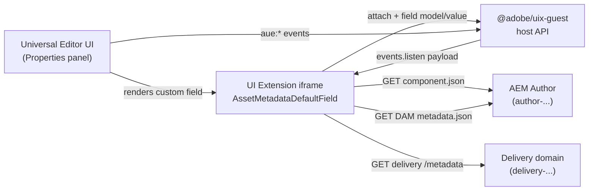

# UE Asset Metadata Defaults — Architecture

> These diagrams use Mermaid. In Cursor, open the Markdown preview; on GitHub, Mermaid renders automatically.

```mermaid
flowchart LR
  UE["Universal Editor UI<br/>(Properties panel)"] -->|"renders custom field"| EXT["UI Extension iframe<br/>AssetMetadataDefaultField"]
  EXT -->|"attach + field model/value"| HOST["@adobe/uix-guest<br/>host API"]

  UE -->|"aue:* events"| HOST
  HOST -->|"events.listen payload"| EXT

  EXT -->|"GET component.json"| AUTHOR["AEM Author<br/>(author-...)"]
  EXT -->|"GET DAM metadata.json"| AUTHOR

  EXT -->|"GET delivery /metadata"| DELIVERY["Delivery domain<br/>(delivery-...)"]
```

