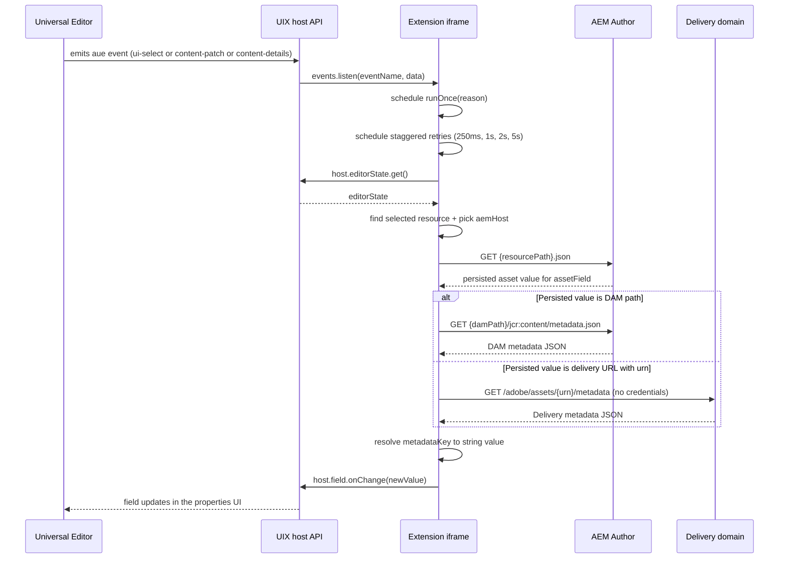

# UE Asset Metadata Defaults — Runtime flow (sequence)

```mermaid
sequenceDiagram
  participant UE as Universal Editor
  participant HOST as UIX host API
  participant EXT as Extension iframe
  participant AUTHOR as AEM Author
  participant DEL as Delivery domain

  UE->>HOST: emits aue event (ui-select or content-patch or content-details)
  HOST->>EXT: events.listen(eventName, data)

  EXT->>EXT: schedule runOnce(reason)
  EXT->>EXT: schedule staggered retries (250ms, 1s, 2s, 5s)

  EXT->>HOST: host.editorState.get()
  HOST-->>EXT: editorState

  EXT->>EXT: find selected resource + pick aemHost
  EXT->>AUTHOR: GET {resourcePath}.json
  AUTHOR-->>EXT: persisted asset value for assetField

  alt Persisted value is DAM path
    EXT->>AUTHOR: GET {damPath}/jcr:content/metadata.json
    AUTHOR-->>EXT: DAM metadata JSON
  else Persisted value is delivery URL with urn
    EXT->>DEL: GET /adobe/assets/{urn}/metadata (no credentials)
    DEL-->>EXT: Delivery metadata JSON
  end

  EXT->>EXT: resolve metadataKey to string value
  EXT->>HOST: host.field.onChange(newValue)
  HOST-->>UE: field updates in the properties UI
```

