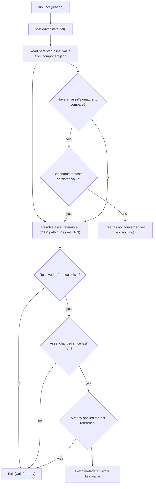

# UE Asset Metadata Defaults — Apply decision logic

```mermaid
flowchart TD
  A["runOnce(reason)"] --> B["host.editorState.get()"]
  B --> C["Read persisted asset value from component.json"]
  C --> D["Resolve asset reference (DAM path OR asset URN)"]
  D --> E{"Resolved reference exists?"}
  E -- "no" --> X["Exit (wait for retry)"]
  E -- "yes" --> F{"Asset changed since last run?"}
  F -- "no" --> X
  F -- "yes" --> G{"Already applied for this reference?"}
  G -- "yes" --> X
  G -- "no" --> H["Fetch metadata + write field value"]

  %% Convergence guard to avoid "lags 1" when component.json has not updated yet
  C --> S{"Have an assetSignature to compare?"}
  S -- "yes" --> T{"Basename matches persisted value?"}
  T -- "no" --> U["Treat as not converged yet (do nothing)"]
  T -- "yes" --> D
  S -- "no" --> D
```

